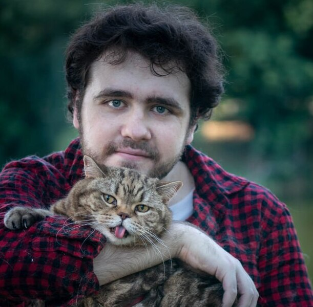

Hi

Hi everyone, my name is Volodymyr, I'm a QA engineer, I hope we will fit perfectly in the team to make a quality product. A little about me and my knowledge

My education and tools and technologies

I am currently studying at the state university of enonomics and technologies.
Specialization - software engineering on the 3th year of study
I took QA courses from POPELYSHKO NATALIIA. Where studied to use for QA such things as:

+ Jira
+ TestRail
+ JSON
+ XML
+ HTML/CSS
+ REST API/ POSTMAN
+ Fiddler
+ Chrome Devtools
+ GIT
+ MySQL

My tasks:
+ QA - https://github.com/vovaorangecat/My_Studies
+ Mini PHP SITE - https://github.com/vovaorangecat/PHPSite/tree/main

My contact information:
+ Phone number - 380963356822
+ Emeil - vova.kosyak7@gmail.com
+ Telegram - https://t.me/Orange_cat7kg

